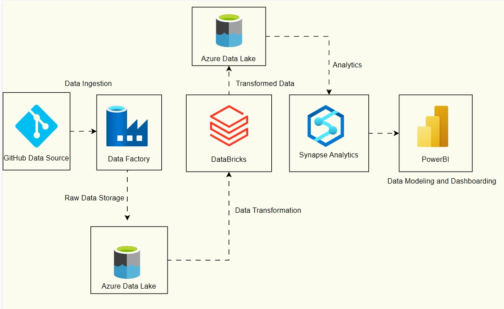

# 🏅 Tokyo Olympics Data Engineering & Analytics Project

## 📌 Project Overview
This project demonstrates an **end-to-end data engineering and analytics pipeline** using **Microsoft Azure & Power BI**, applied to the **Tokyo Olympics dataset**. The goal was to **ingest, transform, model, and visualize** Olympic data to extract meaningful insights.

## 🔧 Tech Stack & Tools
- **Cloud Platform**: Microsoft Azure  
- **Data Ingestion**: Azure Data Factory  
- **Storage**: Azure Data Lake Gen2  
- **Data Transformation**: Azure Databricks (PySpark)  
- **Data Warehouse**: Azure Synapse Analytics  
- **Visualization**: Power BI  

---

## ⚙️ **Architecture**
Below is the high-level **architecture diagram** illustrating the ETL and analytics workflow:

  

---

## 📂 **Dataset & ETL Process**
The project involved multiple datasets covering **athletes, teams, coaches, events, and medals**. The ETL process follows these key steps:

1. **Data Ingestion**:  
   - Used **Azure Data Factory** to fetch raw CSVs and store them in **Azure Data Lake Gen2**.  

2. **Data Transformation**:  
   - Used **Azure Databricks** (PySpark) to clean, standardize, and merge datasets.  
   - Handled missing values, duplicates, and inconsistent country/event mappings.  
   - Wrote the cleaned data back to **Data Lake Gen2** for further analysis.  

3. **Data Warehousing**:  
   - Loaded transformed data into **Azure Synapse Analytics** for optimized querying.  
   - Designed a **star schema** model to improve reporting efficiency.  

---

## 📊 **Data Modeling & Analytics**
After structuring the data, the next step was to **build a Power BI dashboard** that provided deep insights into the Olympic results:

### **Key Dashboards & Insights:**
✅ **Medal Leaderboard** – Dynamic ranking of countries by total medals 🏆  
✅ **Athlete Performance** – Medals per athlete, highlighting country efficiency  
✅ **Gender Participation Trends** – Male vs. Female distribution across disciplines  
✅ **Coaching Impact** – Analyzing whether larger coaching teams contributed to better performance  

### **Performance Optimizations**
⚡ **Pre-aggregations** in Azure Synapse for optimized Power BI queries  
⚡ **Calculated DAX Measures** for real-time filtering and ranking  
⚡ **Data Partitioning** in Data Lake for improved retrieval speed  

---

